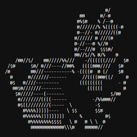

# Google FooBar

<!-- PROJECT LOGO -->

My attempt to solve the Google FooBar Challenge problems, attempted January 2020 during my AP Computer Science Principles classes. Unfortunately, a majority of my solutions were lost to time, so some of my soltions include techniques I learned after the attempt.
